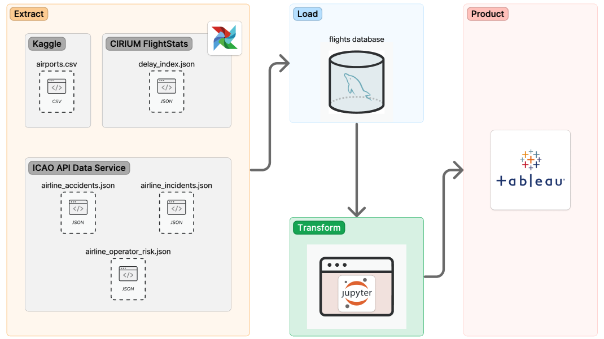

# Real-time Flight Incidents Data Pipeline

This project is intended to develop a production-ready data pipeline using flight data from several APIs for the University of San Diego course ADS 507: Practical Data Engineering. The intended data pipeline collects data from historical and live data sources on topics such as from airports locations, flights, and incidents/accidents that occur within the United States. The data was extracted, transformed, and loaded into a Tableau dashboard that illustrates air traffic incidents based on factors such as flight operators, airport, aircraft, and current airport delays. By understanding these trends, both consumers and airplane regulators can have a large picture understanding of the most frequent air travel incidents, and develop better regulations and aircraft designs for the future of air travel safety.

#### -- Project Status: [In-progress]

## Project Description

### Team 6
* Jacqueline Vo
* Landon Padgett

## Requirements

To replicate this project, the following technology will be needed:
- [Python](https://www.python.org/) Version 3.11.5
- [MySQL](https://www.mysql.com/) Version 8.0.35
- [Apache Airflow](https://airflow.apache.org/) Version 2.8.1

## Project Datasets
- airports.csv - [Kaggle](https://www.kaggle.com/datasets/tylerx/flights-and-airports-data?select=airports.csv)
- airline_accidents.json, airline_incidents.json, and airline_operator_risk.json - [ICAO API Data Service](https://applications.icao.int/dataservices/default.aspx)
- delay_index.json - Delay Index API from [CIRIUM FlightStats](https://developer.flightstats.com/api-docs/delayindex/v1#IntDoc)

## ELT Data Pipeline

## Database Schema

